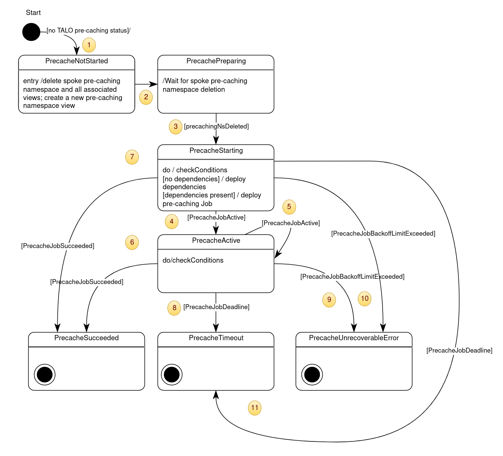

# Cluster upgrades - image pre-caching #
## Background ##
Cluster upgrades need to be completed within a 4 hour maintenance window.  This also needs to include time to resolve a failed upgrade.\
There are several gigabytes of artifacts that need to be downloaded to the spoke for a full upgrade.\
SNO spoke clusters may have limited bandwidth to the hub cluster hosting the registry, which will make it difficult for the upgrade to complete within the required time.\
In order to ensure the upgrade can fit within the maintenance window, the required artifacts need to be present on the spoke cluster prior to the upgrade.
## Definitions ##
### Hub cluster ###
Hub is an OCP cluster running an instance of Red Hat Advanced Cluster Management (RHACM) multi-cluster hub and an instance of topology-aware-lifecycle-operator (TALO). \
It manages a set of spoke clusters by applying configurations created by [ZTP workflow](https://github.com/openshift-kni/cnf-features-deploy/tree/master/ztp) and TALO (this repository).
Hub cluster holds the `cluster-admin` role required to access the spoke clusters it manages, and version information required to perform the desired upgrade in the form of policies listed in TALO Custom Resource.
### Spoke clusters ###
Spoke clusters are single-node clusters managed by the Hub. There is one hub per many spokes.
### Pre-caching workload ###
Pre-caching workload is a one-shot task created on each of the spoke cluster nodes to pull container images required for the upgrade and make them locally available to the container runtime during the upgrade. For SNO spokes it is realized as a `batch/v1 job`.
### Maintenance windows ###
Maintenance windows configuration is not provisioned by TALO. A user applies TALO CR at the maintenance window beginning, timing it manually or using external automation. The procedure starts as soon as TALO CR is created, and ends upon expiration of the procedure timer defined in the TALO CR.\

## Procedure ##
### On the hub ###
- User creates a TALO CR that defines:
    - A set of clusters to be upgraded
    - References to the policies containing the required release and operator versions for this set
    - The need for image pre-caching
- User applies the TALO CR to the hub cluster at the beginning of the maintenance window
- TALO checks the pre-caching requirement in the TALO CR. If required, then for each cluster defined or matched by selectors: 
    - Cleans up possible remainders from the previous pre-caching attempts
    - Determines the required software version specification
    - Creates the version spec Configmap object on the designated spoke
    - Deploys a pre-caching workload on the designated spoke. 

#### State machine ####
Please note that pre-caching functionality is implemented using ManagedClusterAction and ManagedClusterView hub resources, and not direct API calls to the managed clusters.\

##### States #####
- PrecacheNotStarted is the initial state all clusters are automatically assigned to on the first reconciliation pass of the TALO CR. Upon entry TALO deletes spoke pre-caching namespace and hub view resources that might have remained from the prior incomplete attempts. TALO also creates a new ManagedClusterView resource for the spoke pre-caching namespace to verify its deletion in the PrecachePreparing state
- PrecachePreparing state is for waiting for the cleanup completion
- PrecacheStarting state is for the creation of pre-caching job pre-requisites and the job itself
- PrecacheActive - the job is in "Active" state
- PrecacheSucceeded - a final state reached when the pre-cache job has succeeded
- PrecacheTimeout - a final state meaning that artifact pre-caching has been partially done
- PrecacheUnrecoverableError - a final state reached when the job ends with a non-zero exit code

##### Transitions #####
1. Start transition occurs when no prior status exists for TALO CR
2. Unconditional transition after the creation of new ManagedClusterView resource for the spoke pre-caching namespace has been requested
3. The spoke pre-caching namespace does not exist
4. Transition from PrecacheStarting to  PrecacheActive state upon pre-cache job reaching its "Active" state
5. Periodical check result - the job remained in the active state
6. The job succeeded
7. Transition from "Starting" to "Succeeded" bypassing "Active" is possible if there are many clusters to loop around and in the same time most (or all) of the pre-caching has been already done on the previous attempts
8. Job deadline occurred - partial completion
9. Pre-cache job failed with a non-zero exit code
10. Pre-cache job failed (very fast) with a non-zero exit code 
11. Similar to #8, but likely to happen only if the TALO timeout was too small

### On the spoke ###
The pre-caching workload generates a list of images and the correspondent pull specifications from the software version spec provided by TALO in the Configmap resource, and starts pulling them.
#### Procedure end options ####
- Success (“Completed”)
- Failure due to timeout (“DeadlineExceeded”) 
    - the procedure did not complete due to a timeout and can be continued
    - Unrecoverable error (“BackoffLimitExceeded”) - user intervention is desired to determine the failure reason

